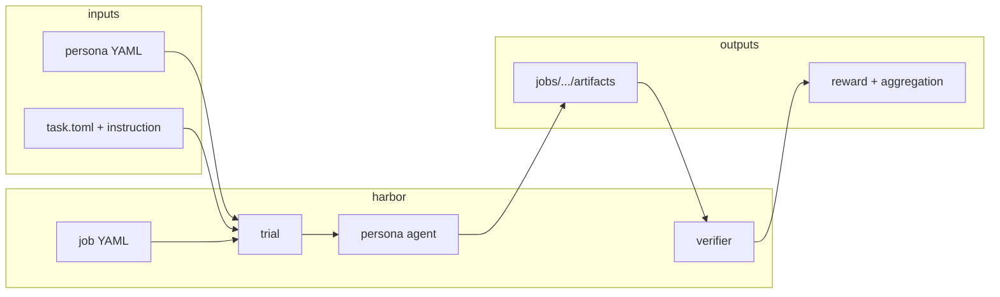

# Environment

This page covers how simulations run — Matraix Playground jobs, trial execution, persona
agents, shared task environments, and optional remote workers.

---

## How it works

MatrAIx separates **what to simulate** (persona profiles and task scenarios) from **how to execute it** (runtime and agents):

```text
  persona/datasets/          application/tasks/           environment/
  (YAML profiles)            (scenario + verifier)        (runtime + agents)
        │                            │                            │
        └──────── persona_path ──────┴──── task path ─────────────┘
                                     │
                              Matraix Playground job YAML
                                     │
                         trial → agent → artifacts
                                     │
                              jobs/<job_name>/
```

| Layer | Path | Responsibility |
|-------|------|------------------|
| Persona input | `persona/datasets/matraix-persona-dev-sample/` | *Who* the simulated user is |
| Task definition | `application/tasks/<name>/` | *What* they do (`instruction.md`, verifier, `reporting.json`) |
| Task environment | `environment/task-environments/application/` | Docker images, sidecars, browser stacks |
| Runtime | `environment/runtime/harbor/` | Job/trial loop, backends (host, docker, use-computer, …) |
| Agents | `environment/agents/matraix/agents/` | `persona-claude-code`, `persona-browser-use`, `persona-computer-1`, … |
| Job recipes | `configs/jobs/` | Multi-trial batches, concurrency, agent/model defaults |
| Outputs | `jobs/` | Per-trial artifacts, verifier results, optional aggregation |

Task folders define scenarios; Matraix Playground + agents execute them. Persona data is
**referenced** (`persona_path=…`), never copied into task folders.

---

## Execution surfaces

Three ways to launch the same Matraix Playground contract:

| Surface | When to use | Entry |
|---------|-------------|-------|
| **Matraix Playground CLI** | Scripts, CI, debugging | `uv run matraix run -c configs/jobs/…` |
| **Playground** | Interactive task play, persona sampling | [quickstart.md §10](../quickstart.md#10-playground-play-tasks-visually) |
| **Playground API** | Automation, external tools | `POST /api/harbor/jobs` — [rest-api.md](../application/playground-api.md) |

All paths share:

- the same task folders under `application/tasks/`
- the same artifact layout under `jobs/<job_name>/`
- the same agent and backend resolution rules

### Execution planes

| Plane | Meaning | Configure |
|-------|---------|-----------|
| `harbor` (default) | API or laptop runs the job locally | `MATRIX_EXECUTION_PLANE=harbor` |
| `remote` | API dispatches to a Remote Runner worker over HTTP | `MATRIX_EXECUTION_PLANE=remote` + `REMOTE_RUNNER_API_URL` |

Remote plane details: [unified-runtime.md](runtime.md).

### Compute family

| Family | Meaning | Configure |
|--------|---------|-----------|
| `local` (default) | Trials on the Harbor orchestrator | `MATRIX_COMPUTE_FAMILY=local` |
| `modal` | Survey, chat, web, Linux on Modal | `MATRIX_COMPUTE_FAMILY=modal` + Modal deploy |
| `gcp` | Survey, chat, web, Linux on GKE | `MATRIX_COMPUTE_FAMILY=gcp` + cluster + host image |

Default is `local`. Set `modal` / `gcp` only for remote trials. If you already
run on Modal, switch web to GKE when daily concurrency saturates. See
[runtime.md](runtime.md).

**Security note:** the remote plane sends only `PYTHONPATH` and `MATRIX_*` task exports over HTTP. API keys must live on the **worker**, not in the dispatch payload.

---

## Directory structure

```text
environment/
  agents/matraix/      Persona-conditioned agent implementations
  runtime/harbor/           Matraix Playground CLI, trial loop, models, verifier, viewer backend
  task-environments/
    application/            Persona shared-* + SUT *-sidecar_* (shared-chat-persona, 
                            chatbot-api-sidecar_*, chatbot-mcp-sidecar_*, 
                            web-sidecar_*, shared-web-*, shared-os-app-*, …)

configs/jobs/
  example-job-recipe/       Smoke + small local demos
  application-task-job-recipe/  Generated multi-persona application jobs

packages/
  playground/             Playground Python package (remote runner, harbor helpers)
  rewardkit/                Verifier / LLM-judge toolkit

apps/viewer/                Frontend paired with `harbor view`
```

Python import names stay stable: `harbor.*`, `matraix.agents.*`, `playground.*`.

---

## Environment variables

### Execution plane

| Variable | Purpose |
|----------|---------|
| `MATRIX_EXECUTION_PLANE` | `harbor` (default) or `remote` |
| `MATRIX_COMPUTE_FAMILY` | `local` (default), `modal`, or `gcp` |
| `MATRIX_SHARD_CONCURRENCY` | Max workers for one job (default `8`) |
| `MATRIX_HOST_PACK_CONCURRENCY` | Max survey/chat processes per Modal / GKE host worker (default `32`; does not override Playground Parallel) |
| `MATRIX_WEB_PACK_CONCURRENCY` | Max browsers per Modal / GKE web worker (default `1`) |
| `MATRIX_MAX_CONCURRENT_TRIALS` | Optional cap on Playground Parallel |
| `MATRIX_GKE_CLUSTER` / `MATRIX_GKE_REGION` / `MATRIX_GKE_REGISTRY` | GKE cluster for `computeFamily=gcp` |
| `MATRIX_GKE_HOST_IMAGE` | Image for survey/chat GKE host workers |
| `MATRIX_CHATBOT_PUBLIC_URL` | Tunnel/public URL forwarded to Modal/GKE instead of localhost sidecars |
| `MATRIX_CHATBOT_TUNNEL` | `auto` / `cloudflared` / `ngrok` publishes the local chat sidecar to Modal/GKE. Unset keeps the sidecar private |
| `REMOTE_RUNNER_API_URL` | Remote runner base URL (required for `remote`) |
| `REMOTE_RUNNER_API_KEY` | Optional bearer token for the worker API |
| `REMOTE_RUNNER_HARBOR_COMMAND` | Override `harbor` CLI on the worker |
| `REMOTE_RUNNER_INLINE` | Dev/tests: run jobs inline in the API process |

### Task exports (local + remote worker)

`matraix run` sets these automatically from the generated job files. Export
them manually only when bypassing `matraix run`:

| Variable | When |
|----------|------|
| `MATRIX_SURVEY_TASK_PATH` | Survey / json-survey trials |
| `MATRIX_CHATBOT_TASK_PATH` | Chatbot / user-sim trials |
| `MATRIX_CHATBOT_DOMAIN` | Recommender domain (legacy compat) |
| `MATRIX_CHATBOT_APPLICATION_ID` | Chat sidecar application id |
| `MATRIX_CHATBOT_APPLICATION_CONTEXT` | Chat sidecar context |
| `MATRIX_CHATBOT_MAX_TURNS` | User-sim turn cap |

### Model credentials (local process / worker)

Not sent over the remote plane. Per-agent names:

| Agents | Typical keys |
|--------|----------------|
| `persona-claude-code`, `persona-json-survey`, browser/CUA personas | `ANTHROPIC_API_KEY` |
| User-sim / OpenAI backends | `OPENAI_API_KEY` |
| `persona-browser-use`, OpenHands SDK | `LLM_API_KEY` or provider-specific |
| `persona-computer-1` on use.computer | `USE_COMPUTER_API_KEY` |

Full matrix: [choosing-an-agent.md](agents.md).

### Playground reporting (optional)

| Variable | Purpose |
|----------|---------|
| `PLAYGROUND_REPORTING_ENABLE_LLM` | Enable LLM judge rollups in aggregation |
| `PLAYGROUND_REPORTING_LLM_MODEL` | Override judge model |

---

## One trial, end to end



1. **Job recipe** selects task path, agent, model, and N persona paths.
2. **Trial** picks one persona, materializes instruction, runs the agent.
3. **Verifier** (`application/tasks/.../tests/`) scores outputs under `/logs/verifier/`.
4. **Aggregation** (`report_job.py` or Playground) rolls up batch metrics from `reporting.json`.

---

## Benchmark adapters

External Harbor-format benchmark adapters (for example SimpleQA) are **not
shipped in this public repository**. They convert third-party benchmarks into
generic Harbor task directories, which is a different contract from MatrAIx
`application/tasks/*`. Keep and develop adapters in the private Community tree
if you need that workflow.

---

## Docker snippets

`environment/docker-snippets/` holds shared Docker helper scripts for Playground task images. Because Matraix Playground builds each task from its own `environment/` directory, task Dockerfiles cannot reliably `COPY` from this shared location, so the canonical script lives here and is synced into task-local copies:

```bash
python scripts/sync_docker_snippets.py --write    # sync copies (CI uses --check)
```

The main snippet is `install-claude-code.sh`, which installs Claude Code, `uv`, and base runtime directories for the `persona-claude-code` survey/chat task images.

---

## Singularity / Apptainer (HPC)

`environment/runtime/harbor/environments/singularity/` provides a Matraix Playground environment backend for running tasks on HPC/SLURM clusters using [Singularity/Apptainer](https://apptainer.org/) containers instead of Docker. The host-side `singularity.py` converts Docker images to `.sif`, launches the container, and drives it over HTTP to a small FastAPI server (`server.py`) started by `bootstrap.sh`. Features include file-locked image caching, a memory watchdog, port-collision retry, and dpkg overlay-compatibility fixes.

```bash
harbor trials start -p /path/to/task \
  --environment-type singularity \
  --environment-kwarg singularity_image_cache_dir=/path/to/sif/cache
```

In `task.toml`, set `[environment].docker_image` to a Docker image name (converted to `.sif` automatically) or to a pre-built `.sif` path. Additional kwargs: `singularity_image_cache_dir`, `singularity_force_pull`, and `singularity_no_mount`.

---

## Leaderboard submission (CLI)

`environment/runtime/harbor/leaderboard/` adds CLI support for submitting a run to a Matraix Playground Hub leaderboard and validating it. `harbor leaderboard submit` runs static validation plus the Hub RPCs. Dynamic validation runs in a separate deployable worker (its Docker image and deploy workflow are not part of this repository).

---

## Related documentation

| Doc | Topic |
|-----|-------|
| [Handbook](../README.md) | Docs home |
| [Agents](agents.md) | Agent ↔ API key matrix |
| [Runtime](runtime.md) | Matraix Playground vs remote plane |
| [Large-scale runs](large-scale-runs.md) | Bigger cohorts, one job |
| [Web interaction](web-interaction.md) | Playwright / browser-use / Cocoa / CUA |
| [Application](../application/README.md) | Tasks and Playground |
| [Playground API](../application/playground-api.md) | HTTP API reference |
